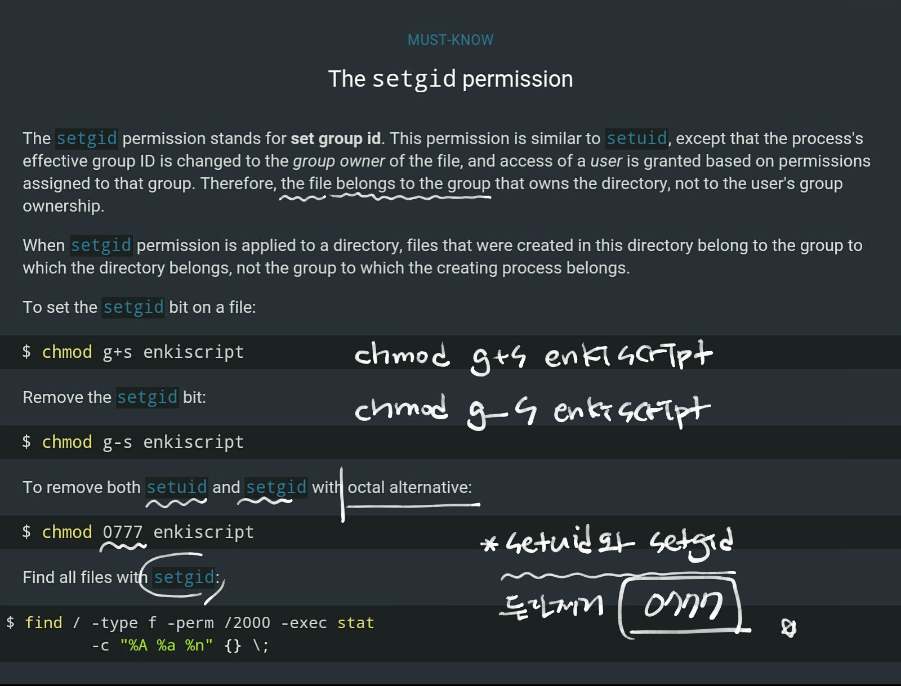
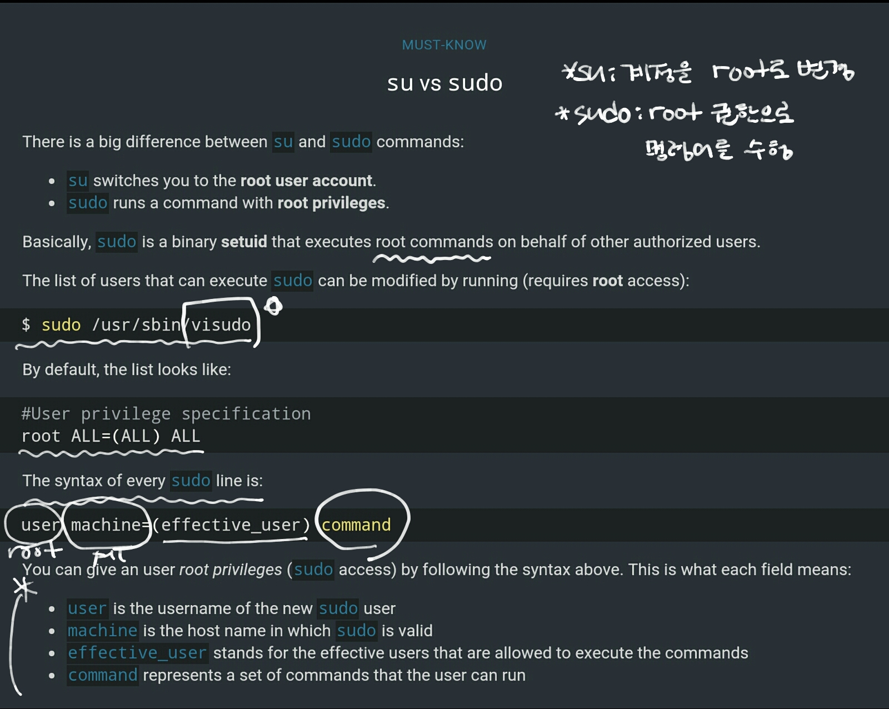
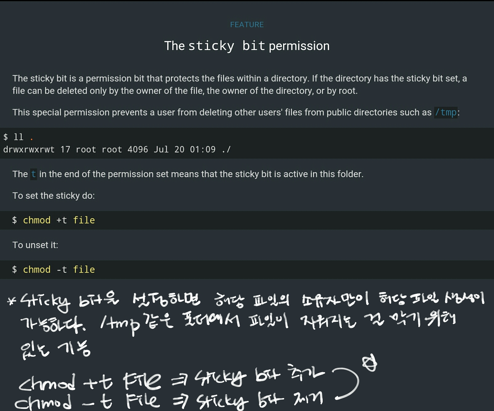
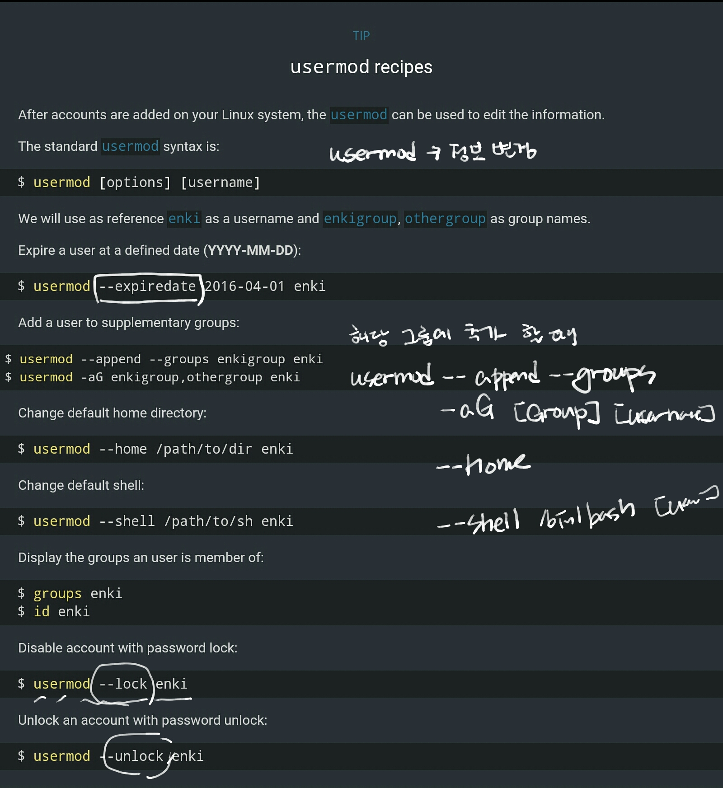
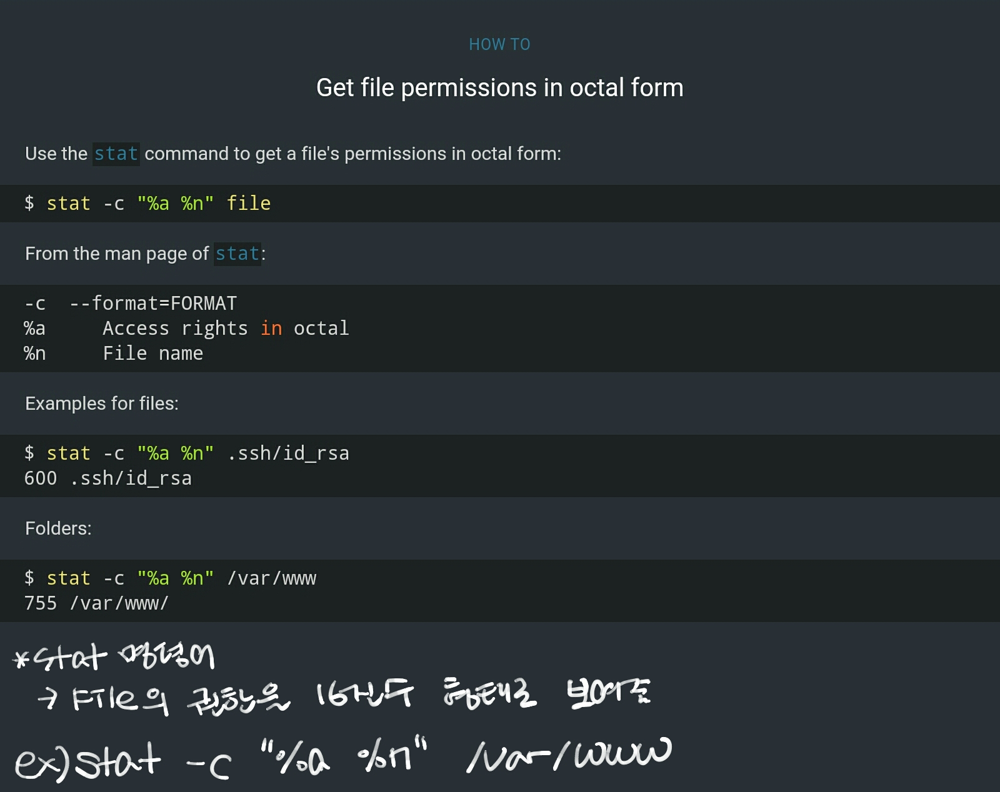

### The setgid permission



setgid는 해당 생성 파일이 해당 디렉토리를 소유한 그룹에게 속하도록 하기 위해서 설정한다. 방법은 `chmod g+s [File명]` 해제할 땐 반대로 `chmod g-s [File명]`

```{.bash}
$ find / -type f -perm /2000 -exec stat -c "%A %a %n" {} \;
```
=> 타입이 파일이고 setgid를 가지고 있는 파일을 찾앗 stat를 통해서 내용을 보여줘라~는 내용.

<BR>
### su vs sudo



+ sudo는 root의 권한을 위임.
+ su는 계정을 root로 변경.

visudo의 경우 설정이
user machine(efective_user) command

+ user : account name
+ machine : hostname
+ effective_user : sudo명령을 쓸수 있도록 허용해주는 user
+ command 명령어

<BR>
### The sticky bit permission



<BR>
### Usermod recipes



<BR>
### Get file permissions in octal form




